```{r setup, include=FALSE}
knitr::opts_chunk$set(echo = TRUE, message=FALSE, warning=FALSE)
```

If you'd like to skip straight to the analysis, skip to Section 4. If you'd like to view the code, see the [github repo](https://github.com/equan06/london_marathon). See london.py for scraping code and the Jupyter Notebooks for plot generation.

# Introduction

  The [London Marathon](https://en.wikipedia.org/wiki/London_Marathon) is a race (26.2mi/42.2km) held annually in April since 1981, and is one of the 6 [world marathon majors](https://en.wikipedia.org/wiki/World_Marathon_Majors). This analysis uses the data of 234,613 London finishers from 2014-2019, and covers both finisher demographics and best strategy to pace a marathon.

As someone who's never run a marathon before, I was particularly interested in the best approach to pacing a marathon (negative/positive/even). Negative splits mean running faster in the second half, positive splits mean the opposite, and even splits mean running a consistent pace throughout.

Several other people with quantitative backgrounds have looked at this before; the general consensus is even/negative splits are preferable over positive. Jared Ward (6th place at the 2016 Rio Olympic marathon and BYU stats professor) wrote his master's thesis on the topic, taking a Bayesian approach to modeling split pacing strategies using quarter splits (time through the 4 quarters of the race). I also came across Jonathan Savage's [analysis](https://fellrnr.com/wiki/Negative_Splits) which looked at a large dataset from NYC and Chicago, but he only analyzed the half splits (first/second). So I wanted to find a race that had comprehensive split data across the entire race (splits every 5K). London also happens to be relatively flat, which removes the effect of elevation on pace.

# Demographics

The 2014-2019 data contains 234,613 finishers. People who DNFed (Did Not Finish) the race were not present in the race results. Of the finishers, roughly 6,000 of them had missing split data at some point throughout the race, so these runners were included in the demographic analysis but excluded from the pace analysis. 


With that in mind, here are some graphs.

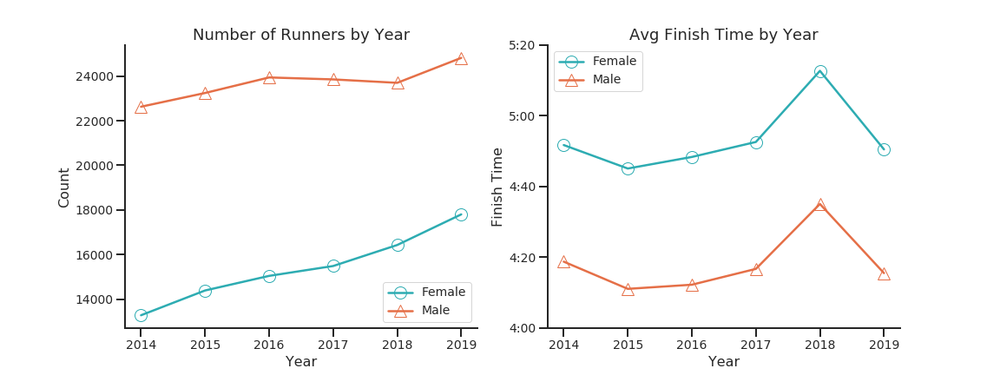

As marathon running has become more trendy as of late, running participation and female participation have increased over time (from 37% to 42% female). Now what happened to finish times in 2018? According to officials, 2018 reached record temperatures of 23C/73F - and it's no surprise that temperature has a measured [negative effect](https://www.medscape.com/viewarticle/555022) on running performance in longer races.

Here's the distribution of finish times.

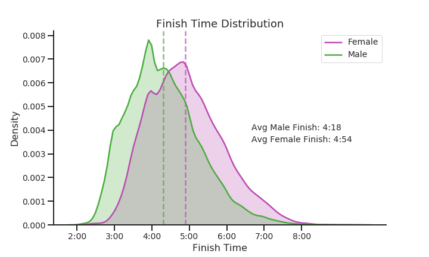

You can see that there are sharp points of maxima around 3:00 and 4:00 with a large cluster of runners; this is the well known phenomenon of runners clustering around common goal times (typically multiples of 30 min).

Here are the finish times of the runners in the top-X percentile for London 2019.

|Top Percentile|Male|Female|
|---|---|---|
|0.1%|02:15:06|02:31:53|
|0.5%|02:30:12|02:56:07|
|1%|02:35:39|03:03:00|
|5%|02:52:03|03:24:33|
|10%|03:03:36|03:36:55|
|25%|03:34:30|04:04:30|
|50%|04:09:22|04:45:30|
|75%|04:50:36|05:29:01|

For reference (using US based standards), the [Boston Marathon qualifying standards](https://www.baa.org/2020-boston-marathon-qualifier-acceptances-announced) for males/females in the 18-34 age group respectively are 3:00:00 and 3:30:00, which corresponds to roughly the top 10% of 2019 runners. The [Olympic Trials qualifying standards](https://www.usatf.org/events/2020/2020-u-s-olympic-team-trials-marathon/qualifying-standards) are 2:19:00 and 2:45:00, which corresponds to just over the top 0.1% of men and slightly under the top 0.5% of women.


Here are the age groups: note that young people were binned in a relatively large category, so naturally it's harder to make specific conclusions about the 18-39 group compared to the 40-44 group.

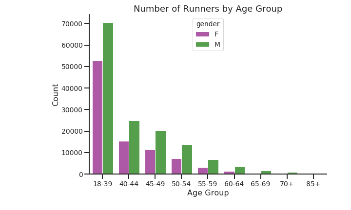

If you're new to the world of marathon running in general, you might think that it's a young person's game. However 48% of the 230,000+ participants were 40 or older, so it's never too late to get started. Indeed, as the next figure shows, younger isn't necessarily faster.


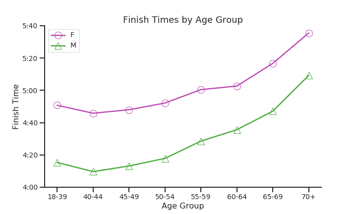

  With respect to age groups, we can see that the the 40-44 group marks the sweet spot between age and performance. This could be due to having more race experience or just the compounding effect of years of training. Many elite marathoners enjoy success well into their 30s - Eliud Kipchoge set the men's world record at 34.
  
Of course it's worth noting again that because of the binning of the 18-39 age group, it would be expected that 30-34 or 35-39 would be the fastest. However, an [internal analysis of Strava data](https://www.theguardian.com/lifeandstyle/the-running-blog/2017/apr/11/strava-releases-london-marathon-training-data-heres-what-it-shows) on the 2016 London Marathon revealed that 25-34 age group was much slower relative to the 35-44 age group, despite the fact that most elites are part of the former. 
  


# Experience and Finish Times


  What about investigating the effect of race experience on finish times? Since we have data spanning multiple years, this allows us to check for repeat runners: runners in 2019 who've raced at least once between 2014-2018. Runners were matched if they had the same name, country, and belonged to the same age category or the age category right below to account for aging; for example, (Jane Doe, USA, 40-44) would match to (Jane Doe, USA, 40-44) or (Jane Doe, USA, 18-39). Roughly 21% of the 41,000+ 2019 runners were flagged as repeat runners.

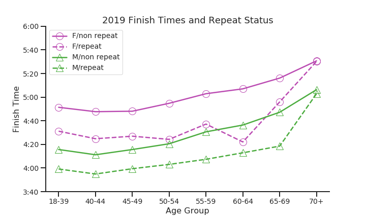

  The effect is clear: repeat runners are consistently faster on average than their non-repeat counterparts across all age groups except for the 70+ category. It's fairly surprising to see how consistent the differential is: respectively, repeat men and women were 17 and 21 min faster on average.

  More surprisingly, the repeat female runners between 60-64 outperformed their non-repeat male counterparts. In fact, they're almost as fast their repeat male counterparts! This can be attributed to selection bias - since the number of repeat female marathoners aged 60-64 is a relatively small group, you're likely to be a pretty comeptitive runner: serious enough to contend with the 60-64 male repeat runners.


# Split Consistency and Coefficient of Variation

  Since we have 5K split data (the time differential between every 5K of the race), we can use this to measure a runner's 'consistency' throughout the race. A consistent runner should run all of their 5K splits close to their overall average marathon pace.
  
  One could compute the standard deviation of a runner's paces, but consider the following two runners in a 3 mile race:

| Runner | Mile 1 | Mile 2   |  Mile 3 |  Avg | StdDev|
|---|---|---|---|---|---|
| A |  7:20 |7:30|  7:40 |  7:30 | 1:40|
| B|  4:20 |  4:30 |  4:40 | 4:30 | 1:40|

  Both runners would have the same standard deviation (1:40). However, the difference between a 4:20 and 4:30 mile is much larger than the difference between a 7:20 and a 7:30 mile; this is just a reflection of how running fast gets exponentially hard. To account for this, we can divide the standard deviation by the average pace, which yields the coefficient of variation (CoV). This is a fairly common metric used in exercise physiology literature.


$$CoV (\%) = \frac{std_X}{mean_X} \times 100$$

Now we can make meaningful comparisons between runners. 

| Runner | Mile 1 | Mile 2   |  Mile 3 |  Avg | StdDev| CoV |
|---|---|---|---|---|---|---|
| A |  7:20 |7:30|  7:40 |  7:30 | 1:40| 22% |
| B|  4:20 |  4:30 |  4:40 | 4:30 | 1:40| 37% | 

Indeed, Runner A has the lower CoV, which reflects that they ran more consistently due to their average pace being slower. We can now continue with the analysis!

These are the results of calculating the CoV for every runner based on their 5K, 10K, etc. up to their 42.2K splits. We can then examine the distribution of the CoV by gender. The medians are represented by the dotted lines. 

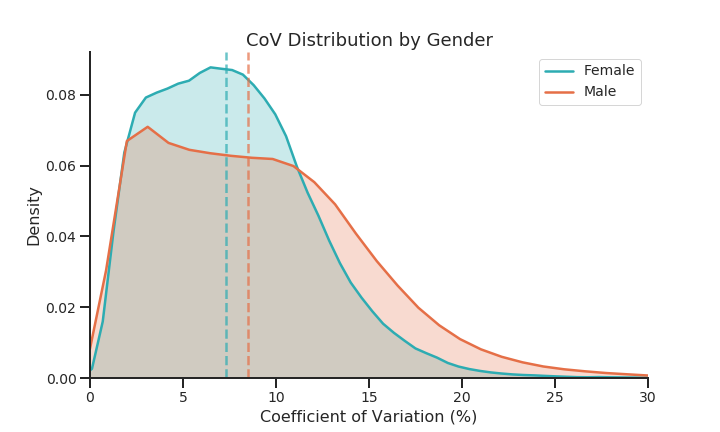

We can see that the female distribution is centered slightly lower; the median female CoV is roughly 1% higher at 7.3% vs 8.5% for males; in other words they're 1% more consistent in pace than males.

What about our group of 2019 repeat runners?

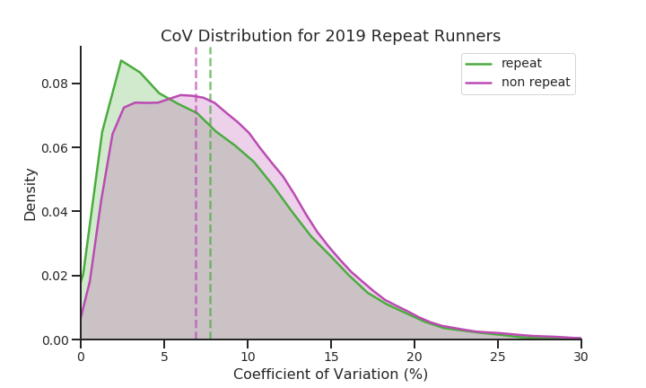


The distribution is roughly the same, but we can still see that the median of the repeat runners is higher than that of the nonrepeat runners.


What about for elite runners?

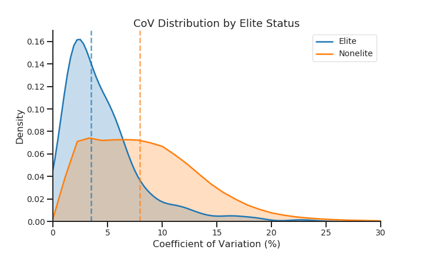

It's no surprise that elites are more consistent than nonelite runners. Conventional running wisdom says that optimal race times come as a result of even pacing. We will explore this later down below!

Things get more interesting when you stratify runners by their finish quartile (with 1,2,3,4 corresponding to the top (25, 50, 75, 100)%) and gender. 

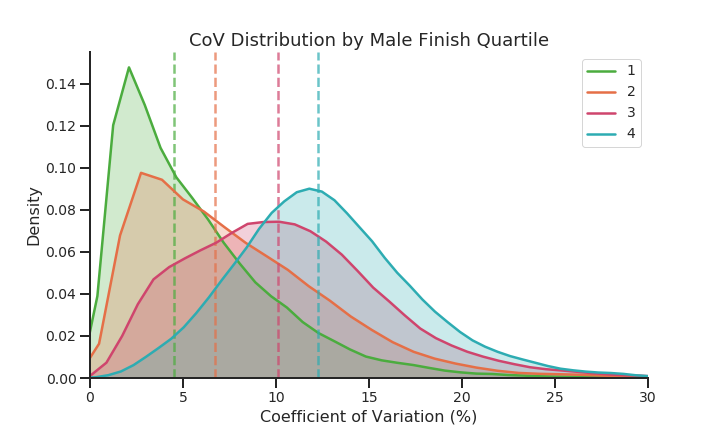

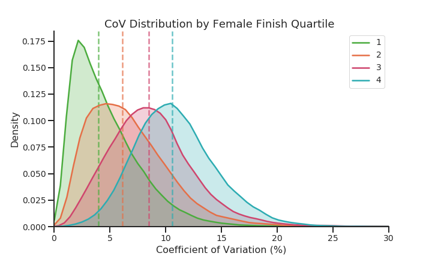

This tells us that runners who finish faster are more consistent, which comes at no surprise. Slower runners are of course more likely to be untrained and inexperienced, leading to more pace variation or an inability to execute their race strategy.


Now we examine the effect of age on consistency and finish times. 

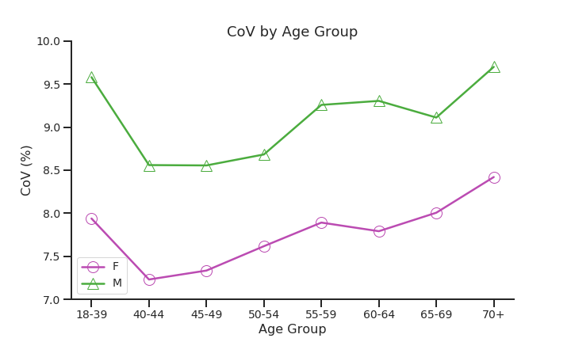

I defined a runner as consistent if their CoV was below the median; if we lower this threshold, the more pronounced the difference in finish times becomes. But as we can see, the difference is already quite pronounced.

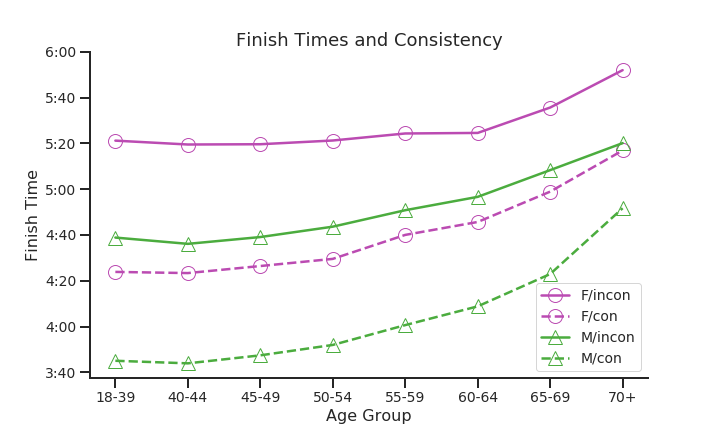


Again, we see that the 40-44 and 45-49 groups are not only the fastest on average, but also the most consistent; on the other hand, the youngest runners are just as inconsistent as the oldest runners! 

Additionally, we can see that the consistent female runners are faster than inconsistent male runners across all age groups. This is to be expected, as consistent runners are more likely to be faster than inconsistent runners; gender is not enough to make up the difference that experience and training brings. 

This leads us to the topic of race strategy: it's clear before doing any substantive analysis that consistency, finish times, and experience are all related. One would expect a consistent runner to finish the fastest; so let's look at the most consistent runners - the even split runners.


# Race Strategy: Negative vs Positive vs Even Splits? 

A common point of race discussion is whether you should run the first half of a race slower, faster, or roughly at the same pace of your second half. We call these 'negative', 'positive', and 'even' split strategies. In general, there is no universal answer to this - in just about every event from the 800m to the marathon, world records have been set with all 3 strategies. However there is a general consensus that the longer the race, the more beneficial an even or negative split.

  With the marathon distance, this becomes of crucial importance - there's a phenomenon that many runners experienced called 'hitting the wall,' which is when the body runs out of fuel (glycogen) in the last few miles of the race. For some, this results in being forced to walk; for others, this results in catastrophic shutdown and potential injury. So you might be punished if you positive split and run too fast at the start. On the other hand, a large negative split might be indicative of a lack of effort at the beginning in which a runner leaves 'too much' in the tank, causing them to finish slower than if they had ran an even split race. If you ask an experienced marathon veteran, chances are they'll tell you to run even splits. 


Now due to the extreme weather conditions of the 2018 race, I have excluded those results from this analysis (since the weather conditions almost invariably forced a positive split strategy). With that in mind, let's dive in.

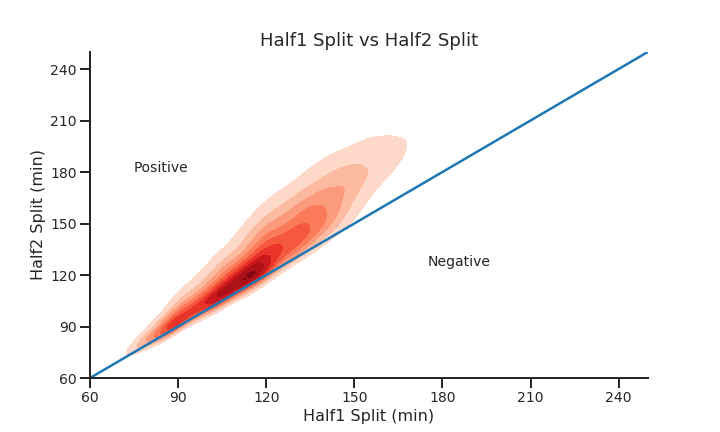

The results are telling: the vast majority of people positive split, whether by choice or necessity.


But what's the best way to define an even split? A common way to do this is to take the split difference (half2 - half1) divided by their finish time, in other words the split difference percentage (SDP). Dividing by the finish time helps to standardize runners by their finish time. A positive split difference results in a positive SDP, and likewise with negative. I then defined an even split as an SDP between -1% and 1%, which led to roughly 10% of runners being categorized as even split runners. 

$$\text{Split Difference } \% = \frac{\text{Half2} - \text{Half1}}{\text{Finish Time}}$$

|Negative|Even|Positive|
|---|---|---|
|SDP $<$ -1%|-1% $\leq$ SDP $\leq$ 1%|SDP $>$ 1%|

Note that this threshold is somewhat arbitrary, but gives us a substantial number of even split runners (10%) to work with. Here are some example splits of a few even split runners sampled from various percentiles. 

|Percentile|5K|10K|15K|20K|25K|30K|35K|40K|42.2K|Finish Time|
|---|---|---|---|---|---|---|---|---|---|---|
|1%|17:32	|17:46	|17:52	|18:13	|17:58	|17:56	|18:04	|18:10	|07:50	|02:31:17|
|5%|19:51	|19:39	|19:49	|19:34	|19:22	|19:23	|19:26	|19:42	|08:38	|02:45:20|
|10%|20:48	|20:36	|20:57	|20:44	|20:35	|20:21	|20:18	|20:51	|09:59	|02:55:04|
|25%|23:49	|22:42	|22:36	|22:50	|22:56	|23:02	|23:21	|23:37	|10:07	|03:14:54|
|50%|25:53	|26:50	|26:09	|26:16	|26:13	|26:39	|26:55	|27:00	|11:41	|03:43:32|
|75%|27:33	|29:29	|29:10	|29:46	|30:40	|28:00	|28:54	|29:51	|13:54	|04:07:13|


This helps put into perspective how few runners ran a true negative split.

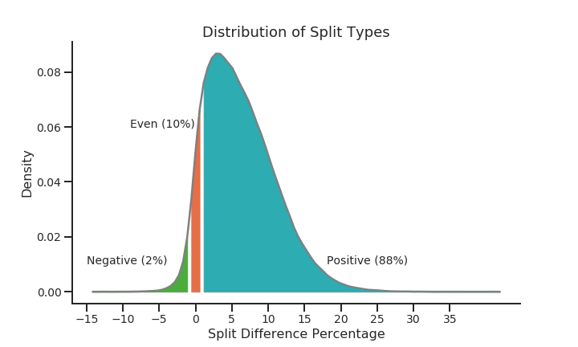

So what's the best split strategy? As shown below, when we stratify by gender and quartile we can clearly see that positive split runners are the slowest in every category. 

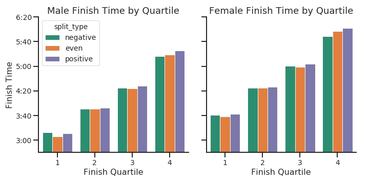

However, it's not immediately clear which of negative or even splits wins; even splits were only significantly faster for Male/Female 1st quartile. Can we do better?

# Even Splits Another Way: Coefficient of Variation

Remember our consistency metric, coefficient of variation? How does the split difference percentage relate to CoV? Of course, these two metrics differ in what what they're trying to measure: SDP only cares about your half splits but also takes into account the direction of the split (was it positive or negative?), while CoV cares about all of your 5K splits and is concerned with whether they're close to the average split (it's only positive). So CoV should be a better way to measure pace consistency just because it takes more datapoints. 

The following graph helps to illustrate the relationship between CoV and SDP.

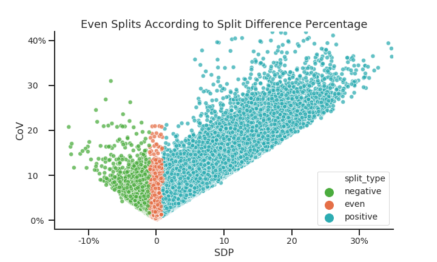

So if we wanted to categorize runners as even/noneven, we could also set an arbitrary CoV threshold, and then compare the results between even/noneven runners. Here the threshold is set to CoV $<$ 2.3, which sets the percent of even runners to roughly 10% (which is what we had with SDP). 

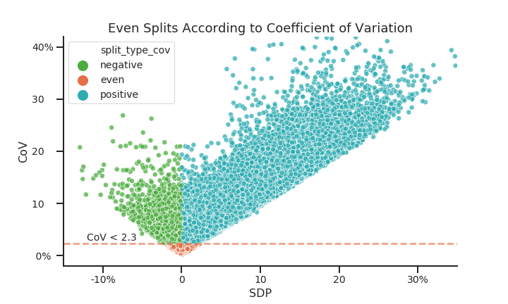

Just by looking at the differences between the two plots, we can easily visualize which subset of runners we're selecting: the SDP definition selected a fair amount of inconsistent runners, whereas the CoV definition selects only consistent runners. Now if we rerun our analysis of whether even splits beat negative splits, here's what happens:


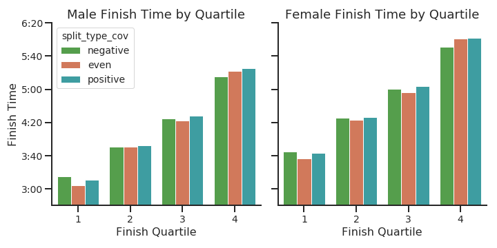

Under our CoV definition of even splits, even split runners beat out negative split runners significantly in all groups except the 4th quartile (male and female). One possible explanation might be that 4th quartile finishers might be less likely to race against the clock as opposed to simply wanting to finish, so pace consistency is less of a concern.

To summarize, classifying even split runners using CoV instead of the SDP leads to a more meaningful analysis since the CoV metric considers multiple times across the race as opposed to just the first/second half and finish.


# Elite Split Profiles

If we restrict our analysis to the 12 total winners, 6 ran even splits, 4 ran positive splits, and 2 ran negative splits. 

A few points of interest:

* 3 of the 6 even splits were from Eliud Kipchoge, the current men's marathon world record holder, the current men's course record holder, and a 4 time London winner.
* Mary Keitany, the current women's course record holder, current women's marathon world record holder (women only race), and 3 time London winner, ran a rather large positive split of 3:13 in 2017 to set the course record. 
* Brigid Kosgei, the current women's marathon world record holder (mixed race), ran a huge negative split of -4:56 in 2019. Note that she broke the world record 6 months later (2:14:04), so clearly 2:18:20 was not indicative of her true potential (which supports the assertion that negative splits are not as effective as even splits).


|	year	|gender	|name	|split_Half|	split_Half2|	split_Finish|	split_delta|	split_type_cov|Notes |
|---|---|---|---|---|---|---|---|---|
|2014|F|kiplagat, edna|01:09:17|01:11:04|02:20:21|01:47|even||
|2014|M|kipsang, wilson|01:02:31|01:01:58|02:04:29|-00:33|even||
|2015|F|tufa, tigist|01:11:43|01:11:39|02:23:22|-00:04|negative||
|2015|M|kipchoge, eliud|01:02:20|01:02:22|02:04:42|00:02|even||
|2016|F|sumgong, jemima|01:10:45|01:12:13|02:22:58|01:28|positive||
|2016|M|kipchoge, eliud|01:01:24|01:01:41|02:03:05|00:17|even||
|2017|F|keitany, mary|01:06:54|01:10:07|02:17:01|03:13|positive|Course Record|
|2017|M|wanjiru, daniel|01:01:43|01:04:05|02:05:48|02:22|positive||
|2018|F|cheruiyot, vivian	|01:08:56|01:09:35|02:18:31|00:39|even||
|2018|M|kipchoge, eliud|01:01:00|01:03:17|02:04:17|02:17|positive||
|2019|F|kosgei, brigid|01:11:38|01:06:42|02:18:20|-04:56|negative||
|2019|M|kipchoge, eliud|01:01:37|01:01:00|02:02:37|-00:37|even|Course Record|


If we expand our analysis to the top 3 finishers in each age category, the results are surprising.

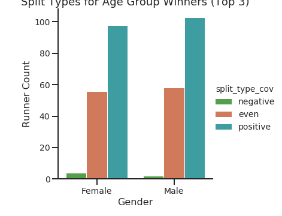

Although there are a large number of even split runners, even the fastest runners across gender and age categories still overwhelmingly tend to run positive splits, and almost nobody runs a negative split race. 

One final remark on even splits: repeat runners in 2019 were 4% more likely to run even splits than nonrepeat runners. 

# Conclusions

* Heat significantly impacts performance 
* Women are more consistent than men with respect to pacing
* Runners in the 40-44 age group are on average the most consistent and the fastest age demographic 
* To define even splits, use the coefficient of variation of a runner's splits rather than the split difference percentage (assuming you have the split data)
* **Even splits yield the fastest performances** across all gender, finish, and age categories except for the 4th quartile of runners
* Despite the above, **nearly everyone positive splits** (including the majority of elite runners and 1/3 of the 2014-2019 winners)


By stratifying across various categories (age, gender, consistency, finish time quartile, top runners), I've provided some substantial evidence towards the relationship between pacing and performance, which have also been observed through analyses of other major marathons. While it is difficult to infer causal relationships from this data (namely a lack of pre-race covariates), this is a good starting point for any serious analysis. Overall, the sage advice of 'don't run positive splits' holds up. 

One final note: London 2020 features a highly anticipated matchup between two running greats while also giving us a preview for the 2020 Olympic Marathon race in Japan. Eliud Kipchoge, the current men's marathon world record holder at 2:01:39 and the only person to run below 2:00 for the marathon distance, will face off against arguably the greatest distance runner of all time, Kenenisa Bekele, who holds both the 5K and 10K world records and ran the second fastest marathon of all time at 2:01:41 (missing Kipchoge's record by a mere 2 seconds). London 2020 will take place on Sunday, April 26th. 

# Statistical Tests Used

To compare finish time differences across split strategy, gender, & finish quartile, a three-way ANOVA was run followed by post-hoc tests (Benjamini-Hochberg with a false discovery rate at .05). The FDR is the expected proportion of Type I errors, in other words the expected number of false rejections of the null hypothesis. 

A regression model was also fitted on the above covariates, yielding 

# References

* https://www.virginmoneylondonmarathon.com/en-gb/event-info/race-results/
* https://www.ncbi.nlm.nih.gov/pmc/articles/PMC4738997/
* http://www.runblogrun.com/2017/04/17/Jared%20Ward%20Thesis.pdf
* https://fellrnr.com/wiki/Negative_Splits


